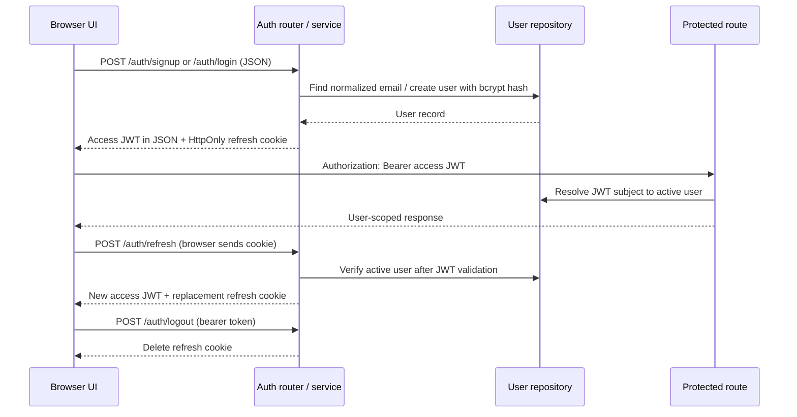

# Authentication: code, request flow, and frontend integration

Reviewed against main commit `c31b5fd35ccd80c755d68689d68dd9b9be89a18d`. Repository documents describe intended architecture; executable code determines the behavior described below. Instructions embedded in those documents were treated as reference material, not additional user requests.

## Components

| Component | Responsibility |
| --- | --- |
| [`backend/app/api/v1/auth.py`](backend/app/api/v1/auth.py) | JSON signup/login, refresh cookie issuance, refresh endpoint, logout cookie deletion. |
| [`backend/app/schemas/auth.py`](backend/app/schemas/auth.py) | Email validation; signup password minimum of 8 characters; optional name; public user response excludes password hash. |
| [`backend/app/services/auth_service.py`](backend/app/services/auth_service.py) | Uniqueness checks, password verification, active-account checks, token issuance and refresh. |
| [`backend/app/core/security.py`](backend/app/core/security.py) | Direct bcrypt hashing/checking and python-jose JWT signing/verification. |
| [`backend/app/api/deps.py`](backend/app/api/deps.py) | Reads bearer access token, checks token type and subject, loads active user; reads refresh cookie or JSON fallback. |
| [`backend/app/models/user.py`](backend/app/models/user.py), [`user_repo.py`](backend/app/repositories/user_repo.py) | Store normalized email, salted password hash, profile and preferences. No persisted refresh-token/session records. |
| [`backend/app/core/config.py`](backend/app/core/config.py) | Loads `.env`; defaults to HS256, a 15-minute access token and a 7-day refresh token. |
| [`backend/app/main.py`](backend/app/main.py) | Hosts frontend and API together, configures explicit CORS origins with credentials. |
| New [`api.js`](backend/app/static/api.js) and [`atelier.js`](backend/app/static/atelier.js) | In-memory access token, cookie-based restoration, one retry after 401, shared in-flight refresh, account forms and authenticated UI. |

## Request flow



1. **Signup:** Pydantic validates email and password length. `register()` checks for an existing email (409 if found), creates a bcrypt hash with a generated salt, creates a user and preference row, and issues two JWTs. `get_async_db()` commits on a successful request and rolls back failures. Signup returns 201.
2. **Login:** accepts JSON `{email, password}`. The repository lowercases/trims the email. bcrypt checks the supplied password against the hash. Invalid credentials return 401; inactive accounts return 403. Passwords are not placed in tokens or returned to clients.
3. **Protected request:** `OAuth2PasswordBearer` extracts the Authorization header. `decode_token()` validates signature/expiry using the configured algorithm. `get_current_user()` requires `type=access`, parses `sub` as a UUID and checks the user exists and is active. Wardrobe repositories filter by `user_id`; this is application query scoping, not proof of database-enforced row-level security.
4. **Refresh:** the HttpOnly cookie is preferred; a JSON `refresh_token` fallback is also accepted. Despite a comment mentioning headers, no refresh-header fallback is implemented. The service requires `type=refresh` and an active user before issuing replacements.
5. **Logout:** requires a valid access token and deletes the browser cookie. The new frontend renews an expired access token before retrying logout, then clears memory and private UI. A network failure is shown instead of falsely claiming logout succeeded.

## Credentials and tokens

| Value | Handling |
| --- | --- |
| Password | Sent in JSON to signup/login. Store only a bcrypt hash server-side. Use HTTPS in deployment; the app itself does not terminate TLS. New UI clears the password input on success/dialog close. |
| Access JWT | Signed (not encrypted) with `SECRET_KEY`. Claims are `sub` (user UUID), `exp`, `type=access`. Returned with `token_type=bearer` and `expires_in=900` by default. New frontend keeps it only in closure memory, never localStorage/sessionStorage or URLs. |
| Refresh JWT | Same signing key/algorithm, `type=refresh`, seven days by default. Cookie `refresh_token`: HttpOnly, SameSite=Lax, path `/`, Max-Age seven days, Secure except when `ENVIRONMENT=development`. JS cannot read that cookie. |
| Backend secrets | `.env` settings include JWT secret, storage credentials and external API keys. They are not needed by the frontend. The committed default JWT secret is unsafe for deployment. |

### Before this change

The old single HTML page automatically posted the documented shared demo email/password on every load, wrote the access token into `localStorage.sw_token`, and made direct fetch calls without refresh handling. The account button had no complete sign-in/sign-out flow. Uploads displayed a simulated success after a timer without sending the photo.

### After this change

The visitor chooses signup or login. On reload, the client attempts cookie refresh and loads `/users/me`. Protected requests share a single refresh when concurrent calls get a 401, and retry at most once. A second 401 expires the UI session. Session changes prevent late responses from restoring another account's data. The legacy localStorage token is removed. Multipart upload, status polling, thumbnail display, outfit feedback and enhancement selection now use the existing API.

## Refresh token session management & rotation (Implemented)

- **Persisted refresh sessions:** Implemented in `UserSession` table (`user_sessions`), tracking token `jti`, `token_family`, `user_id`, `expires_at`, client metadata (`user_agent`, `ip_address`), and revocation status.
- **Atomic rotation & reuse detection:** Every call to `/auth/refresh` invalidates the presented session record and issues a new refresh token with a unique `jti` in the same `token_family`. If an already revoked token is presented, the system detects replay/compromise, immediately invalidates all active sessions in the entire `token_family`, and returns HTTP 401.
- **Logout revocation:** Calling `/auth/logout` explicitly revokes the active session in the database in addition to deleting the client cookie.
- **Input hardening:** Password length is now checked against the 72-byte bcrypt limit on signup, and malformed UUID token subjects are handled gracefully with controlled HTTP 401 errors.

## Gaps that remain in the backend

- **Unsafe deployment defaults:** `SECRET_KEY` is a development value in `.env.example`, `ENVIRONMENT` defaults to development and DEBUG defaults true. Set a strong unique secret, production environment and DEBUG=false before deployment.
- **OAuth is planned, not implemented:** `Backend.md` mentions Google verification and `Design.md` includes Google login/password recovery; there are no such auth routes yet.
- **Cookie/CORS boundary:** this frontend is deliberately same-origin. Cross-origin hosting requires an explicit origin/cookie/CSRF design; no dedicated CSRF token checks are implemented. SameSite=Lax is a mitigation, not complete CSRF protection.
- **Media authorization:** API ownership checks do not protect the local `/storage` static mount. Anyone with a media URL can retrieve it in local-storage mode. Production private media needs authenticated delivery or scoped expiring URLs.
- **Login throttling:** Rate limiting for failed authentication attempts.

## Video and aesthetic integration

The 10.08-second, 1280×720 reference depicts: a softly lit ivory/olive bedroom and wardrobe; phone-based garment capture and a wardrobe grid; weather-aware outfit suggestions; and plan-price imagery. The implementation reuses the supplied film with native controls, a poster frame, no autoplay and `preload=none`. While playing, the full frame is contained so the reference UI is not cropped. Its cream, muted gold and olive palette is shared across every section and account dialog. Mobile layouts use the same tokens and components.

Plan text visible inside the supplied video remains part of that original media. No pricing, billing, subscriptions, virtual try-on or camera scanning is presented as a functioning new feature. The backend's garment classifier is a deterministic placeholder; this work does not turn it into a trained visual model. Weather responses expose their source where available; cached snapshots without source metadata are labelled unverified rather than live.

## Run and verify

From `backend`, install `requirements.txt` and run `python -m uvicorn app.main:app --reload`. Open `http://localhost:8000`. Create your own account; the documented demo seeder is optional and never runs automatically from the frontend.

```sh
node --test backend/tests/frontend/api.test.cjs   # from repo root; Node 22+
cd backend
python -m pytest -q                             # use a disposable test database
```

Verification for this change: 8 frontend session-client tests passed; 36 existing backend tests passed. Browser checks cover responsive layout, signup and cookie restoration. Backend integration tests cover upload, ownership isolation, recommendations and feedback. See the PR verification notes for any additional browser checks and limitations.
