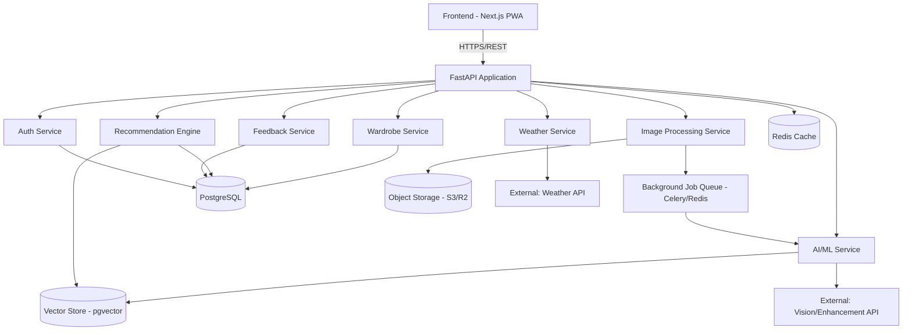
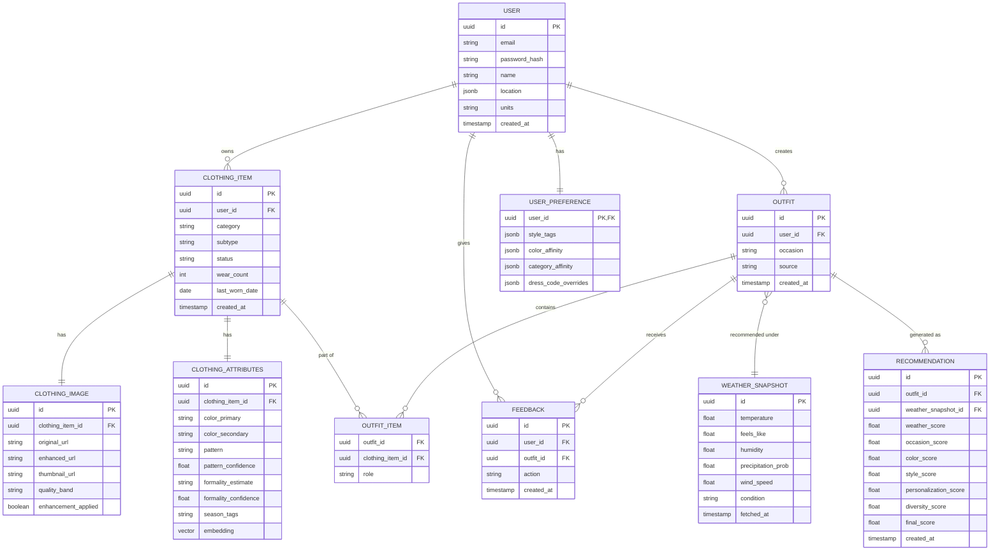

# Backend.md — Smart Wardrobe & AI Recommendation System
### Complete Backend Architecture & Engineering Document

> "CHECK ALL EXISTING IDEAS OF THIS SOLUTION AND THEN MAKE MINE BETTER THAN THEM IN EVERY ASPECT."

---

## 1. System Architecture



**Why this shape improves on a naive "monolith calls one AI blob" design:** the AI/ML Service is isolated behind its own internal interface so that every model (classification, enhancement, embeddings) can be swapped, self-hosted, or upgraded independently without touching the Recommendation Engine, which only ever consumes structured, confidence-scored attributes — never raw model output. This is what makes the "rule-based → ML-based" upgrade path in `Upgradation.md` possible without a rewrite.

**Component responsibilities:**
- **Auth Service:** signup/login, JWT issuance/refresh, OAuth.
- **Wardrobe Service:** CRUD for clothing items, categories, wardrobe queries/filters.
- **Image Processing Service:** upload handling, quality scoring, enhancement orchestration, thumbnail generation.
- **AI/ML Service:** clothing detection, classification, attribute extraction, embedding generation — wraps external/self-hosted models behind one internal interface.
- **Recommendation Engine:** deterministic scoring engine (Pipeline 7) that consumes wardrobe + weather + occasion + preferences and returns ranked outfits.
- **Weather Service:** fetches/normalizes/caches weather data.
- **Feedback Service:** records likes/dislikes/wears, updates user preference weights.

---

## 2. Backend Structure

```
backend/
├── app/
│   ├── api/
│   │   ├── v1/
│   │   │   ├── auth.py
│   │   │   ├── users.py
│   │   │   ├── wardrobe.py
│   │   │   ├── clothing.py
│   │   │   ├── images.py
│   │   │   ├── weather.py
│   │   │   ├── recommendations.py
│   │   │   ├── outfits.py
│   │   │   ├── favorites.py
│   │   │   └── feedback.py
│   │   └── deps.py                # shared FastAPI dependencies (current_user, db session)
│   ├── core/
│   │   ├── config.py               # settings via pydantic-settings, reads .env
│   │   ├── security.py             # JWT, password hashing
│   │   └── logging.py              # structlog setup
│   ├── models/                     # SQLAlchemy ORM models
│   │   ├── user.py
│   │   ├── clothing.py
│   │   ├── outfit.py
│   │   ├── feedback.py
│   │   └── weather_snapshot.py
│   ├── schemas/                    # Pydantic request/response schemas
│   │   ├── auth.py
│   │   ├── clothing.py
│   │   ├── outfit.py
│   │   └── recommendation.py
│   ├── services/                   # business logic, orchestrates repositories + ai + external APIs
│   │   ├── auth_service.py
│   │   ├── wardrobe_service.py
│   │   ├── image_service.py
│   │   ├── weather_service.py
│   │   └── feedback_service.py
│   ├── repositories/                # DB access layer, isolates SQLAlchemy queries from services
│   │   ├── user_repo.py
│   │   ├── clothing_repo.py
│   │   └── outfit_repo.py
│   ├── ai/                          # AI/ML service wrapper layer
│   │   ├── quality.py               # blur/resolution scoring (deterministic, OpenCV)
│   │   ├── enhancement.py           # enhancement model client
│   │   ├── detection.py             # clothing detection/segmentation client
│   │   ├── classification.py        # category/pattern classifier client
│   │   ├── color.py                 # k-means color extraction (deterministic)
│   │   └── embeddings.py            # embedding generation client
│   ├── recommendations/             # the scoring engine (Pipeline 7)
│   │   ├── weather_score.py
│   │   ├── occasion_score.py
│   │   ├── color_score.py
│   │   ├── style_score.py
│   │   ├── personalization_score.py
│   │   ├── diversity_score.py
│   │   └── engine.py                 # combines candidate generation + scoring + ranking
│   ├── weather/
│   │   └── client.py                 # OpenWeatherMap client + normalization + caching
│   ├── image_processing/
│   │   ├── storage.py                 # object storage client (upload/signed URLs)
│   │   └── pipeline.py                # orchestrates: validate → quality → enhance → detect → classify → embed
│   ├── workers/
│   │   └── tasks.py                   # Celery task definitions (image pipeline, embedding jobs)
│   └── main.py                        # FastAPI app instantiation, router registration, middleware
├── alembic/                           # DB migrations
├── tests/
│   ├── unit/
│   └── integration/
├── requirements.txt
├── Dockerfile
├── docker-compose.yml
└── .env.example
```

**Why this structure improves on the example given in the brief:** it separates `services/` (business logic) from `repositories/` (data access) — meaning the recommendation engine and image pipeline can be unit-tested with mocked repositories, and the `ai/` module is a thin client layer so swapping a hosted API for a self-hosted model later (per `Upgradation.md`) touches only files inside `ai/`, never `recommendations/` or `api/`.

---

## 3. Workflow Pipelines

### Pipeline 1 — User Registration
```
User submits signup form (email, password, [name])
 → Validation (Pydantic schema: email format, password strength)
 → Check email uniqueness
 → Password hashed (bcrypt via passlib)
 → User row created in Postgres
 → JWT access + refresh token issued
 → Refresh token set as httpOnly secure cookie; access token returned in response body
 → Frontend redirects to Onboarding
```
If OAuth (Google): token verified server-side against Google's public keys, user matched/created by verified email, same token issuance from that point on.

### Pipeline 2 — Clothing Upload (end-to-end)
```
User uploads image (from Add Clothing screen)
 → File received via multipart upload, streamed (not buffered fully in memory)
 → Validate: MIME type + magic bytes, max size (e.g., 15MB), dimension sanity check
 → Re-encode image server-side (strips EXIF/GPS, neutralizes embedded payloads)
 → Store ORIGINAL in object storage (private bucket, key = user_id/item_id/original.jpg)
 → Enqueue background job (Celery) — respond to client immediately with a "processing" item stub
   Background job:
     → Quality analysis (blur score via Laplacian variance, resolution check, brightness histogram)
     → IF quality poor: flag item as "needs_review", generate enhancement candidate (Pipeline 3), notify client (via polling or websocket) that review is needed
     → IF quality acceptable: proceed directly
     → Clothing detection + segmentation (isolate garment from background/body/other objects)
     → Classification: category (top/bottom/dress/outerwear/shoes/accessory) + confidence score
     → Attribute extraction: color (deterministic k-means on segmented pixels), pattern (classifier + confidence), formality/style (vision-assisted, confidence)
     → Embedding generation (CLIP-style vector) → stored in pgvector
     → Thumbnail generation, stored in object storage
     → DB row finalized: ClothingItem + ClothingImage + ClothingAttributes populated
 → Item appears in wardrobe library, status = "ready" (or "needs_review" if user confirmation pending)
```

### Pipeline 3 — Image Quality / Blur Handling
```
Image upload
 → Quality score (composite of):
      - Blur score: variance of Laplacian (OpenCV) — deterministic, no ML cost
      - Resolution check: minimum width/height threshold
      - Brightness/exposure check: histogram-based, flags too-dark/too-bright
      - Background/subject check: confirms detection model found a garment at all (if detection confidence is near-zero, likely not a usable photo regardless of blur)
 → Composite score classified into three bands: Good / Borderline / Poor
 → Good: skip enhancement, proceed to classification directly
 → Borderline: run enhancement model (upscale + deblur), present before/after to user, let them choose
 → Poor: run enhancement anyway (best-effort), but classification fields are NOT pre-filled with low-confidence guesses — the review screen requires manual entry, and the UI explicitly states the photo quality is limiting automatic detection
 → Enhancement is NEVER applied silently without being shown to the user when the composite score is Borderline or Poor — this transparency is a hard product requirement, not optional
```
**Algorithms/models:**
- Blur/resolution/brightness: OpenCV, fully deterministic, runs in milliseconds, zero external cost.
- Enhancement: a bounded super-resolution/deblur model (Real-ESRGAN-class). Explicitly configured/prompted (if using a generative model) to **only sharpen/upscale existing pixel information** — never generative inpainting of occluded/missing regions. This is a hard constraint: any enhancement approach that hallucinates new texture/pattern detail is disqualified, because it would let the system show the user a garment detail that doesn't exist on the real item.
**Confidence scores:** every classification/attribute prediction downstream carries a 0–1 confidence value. Quality band directly gates how those downstream confidences are treated: photos in the "Poor" band cap all attribute confidences at a low ceiling regardless of what the classifier reports, since a good confidence from a model looking at a bad image is not trustworthy.

### Pipeline 4 — Clothing Classification
```
Image (post quality-gate, using chosen original/enhanced version)
 → Preprocessing: resize/normalize for model input
 → Clothing detection: bounding box(es) around garment(s) in frame
 → Segmentation: isolate garment pixels from background/body/skin (feeds both classification and color extraction)
 → Category classification: top/bottom/dress/outerwear/shoes/accessory (+ subtype e.g. "t-shirt," "jeans" where confidently available) — confidence score attached
 → Color extraction: k-means clustering (k=2-3) on segmented pixels, dominant color(s) reported deterministically — not model-guessed
 → Pattern detection: solid/striped/floral/plaid/other — secondary classifier, lower confidence tier, always shown as editable
 → Material/style estimation: vision-assisted, explicitly labeled "estimated" — lowest confidence tier, most likely to need user correction
 → Embedding generation: single vector representation of the item for similarity search
 → Metadata assembled (category, subtype, color(s), pattern, style tags, formality estimate, all with confidence) → written to DB
```

### Pipeline 5 — Weather Recommendation
```
Weather API (OpenWeatherMap) called with user's saved location
 → Response includes: temperature, feels-like, humidity, precipitation probability, wind speed, condition (clear/rain/snow/etc.)
 → Normalize into internal WeatherSnapshot (consistent units per user preference, °C/°F)
 → Determine clothing requirements deterministically, e.g.:
      feels_like < 5°C          → requires: heavy outerwear, warm layers
      5°C ≤ feels_like < 15°C   → requires: medium jacket/sweater
      15°C ≤ feels_like < 22°C  → requires: light layer optional
      feels_like ≥ 22°C          → requires: breathable/light fabrics
      precipitation_prob > 40%  → requires: water-resistant outerwear/footwear, penalize suede/delicate fabrics
      wind_speed > 30 km/h      → requires: windproof outer layer
 → Filter wardrobe to items whose season/warmth tags are compatible with the requirement band (hard filter for extreme mismatches, soft penalty for near-misses)
 → Generate outfit candidates from the filtered set (Pipeline 7 candidate generation)
 → Score candidates (weather score is one of the weighted factors, see Pipeline 7)
 → Rank and return top N
```

### Pipeline 6 — Occasion Recommendation
```
User selects occasion (College, Casual, Party, Formal, Interview, Date, Travel, Gym, Wedding, ...)
 → Occasion mapped to a dress-code rule set, e.g.:
      Interview  → requires: formality ≥ 0.7, excludes: graphic prints, athletic wear
      Gym        → requires: category in {activewear}, excludes: denim, formal shoes
      Wedding    → requires: formality ≥ 0.6, respects any stored "avoid white/avoid black" social-convention flag (configurable, off by default)
 → Wardrobe filtered by the rule set (hard excludes) 
 → Compatibility engine scores remaining items against soft requirements (e.g., "formal preferred but not mandatory" gets a partial score, not a hard filter)
 → Personalization layer re-weights based on user's past feedback for this occasion specifically (e.g., a user who always dislikes suggested blazers for "Date" gets that preference down-weighted for that occasion going forward)
 → Outfit ranking proceeds via Pipeline 7
```
Dress-code rule tables are stored as data (DB-configurable), not hardcoded in application logic — new occasions can be added without a code deploy.

### Pipeline 7 — Outfit Recommendation Engine (the core algorithm)

**Step 1 — Candidate generation:** rather than scoring every possible combinatorial outfit (which explodes combinatorially), the engine:
1. Buckets wardrobe items by category (top, bottom, dress, outerwear, shoes, accessory).
2. Applies hard filters first (weather-incompatible, occasion-excluded, marked-dirty/in-laundry if that feature is enabled).
3. Generates candidate outfits as either `{dress, [outerwear], shoes, [accessory]}` or `{top, bottom, [outerwear], shoes, [accessory]}` combinations, capped to a reasonable candidate pool (e.g., top 50 by rough pre-filter) before full scoring — this keeps the engine fast even with large wardrobes.

**Step 2 — Scoring.** For each candidate outfit, compute:

```
Final Score = 
      (W_weather   × WeatherScore)
    + (W_occasion  × OccasionScore)
    + (W_color     × ColorScore)
    + (W_style     × StyleScore)
    + (W_personal  × PersonalizationScore)
    + (W_diversity × DiversityScore)

Default weights (tunable per user over time):
  W_weather = 0.25, W_occasion = 0.25, W_color = 0.15,
  W_style = 0.15, W_personal = 0.15, W_diversity = 0.05
```

- **WeatherScore:** how well the outfit's aggregate warmth/water-resistance/wind-resistance matches today's conditions (from Pipeline 5's requirement bands) — 0 to 1.
- **OccasionScore:** how well the outfit satisfies the selected occasion's dress-code rules (Pipeline 6) — hard-excluded items never reach this stage; this scores the soft/partial fit.
- **ColorScore:** color-theory compatibility between the outfit's pieces — deterministic rules (complementary/analogous/monochrome/neutral-anchor patterns) applied to the extracted dominant colors, not a model guess.
- **StyleScore:** cosine similarity between the involved items' embeddings (captures "these silhouettes/aesthetics tend to go together") — this is the one ML-embedding-driven factor in the formula.
- **PersonalizationScore:** derived from the user's historical feedback (Pipeline 8) — items/combinations they've liked/worn score higher, disliked ones lower; starts neutral for new users (cold start) and sharpens with data.
- **DiversityScore:** penalizes outfits nearly identical to ones already shown/worn very recently, so the top results aren't just "the same three outfits every day" — a real complaint pattern in review threads for closet apps that only surface "safe" combinations.

**Step 3 — Ranking:** candidates sorted by Final Score descending, top 3–5 returned with their full score breakdown attached (this breakdown is exactly what `Design.md`'s "Why this outfit" panel renders — no separate explanation is generated after the fact, the UI shows the real computed numbers).

**Rule-based → ML-based transition path:** the weighted-sum formula above is deliberately structured so that, once sufficient labeled feedback exists (Pipeline 8), the weights `W_*` themselves can be learned per-user (e.g., via logistic regression predicting "liked" from the component scores) instead of using the fixed defaults — and eventually the whole scoring function can be replaced by a learned ranker (e.g., LightGBM ranker over the same component features) without changing the API contract, since the engine's output shape (ranked outfits + score breakdown) stays identical. This is detailed further in `Upgradation.md` Level 3.

### Pipeline 8 — Feedback Loop
```
User sees outfit
 → Action: like / dislike / save / mark-as-worn / swap-item / ignore
 → Feedback event stored (user_id, outfit_id, item_ids, occasion, weather_snapshot_id, action, timestamp)
 → User preference weights updated:
      - Simple exponential-moving-average update on category/color/style affinity for MVP (deterministic, fast, explainable)
      - "Mark as worn" also increments each item's wear_count and updates last_worn_date (feeds cost-per-wear stats and the DiversityScore's recency penalty)
 → Over time (once enough events accumulate), feedback data becomes the training set for the learned-weights/ranker upgrade described in Pipeline 7
```
This is how personalization compounds — each interaction is cheap to record and immediately usable in the next recommendation call (MVP), while also being retained as durable training data for the ML upgrade path (Production phase).

---

## 4. API Design

All endpoints under `/api/v1`. Auth required unless noted.

| Method | Endpoint | Purpose | Auth |
|---|---|---|---|
| POST | `/auth/signup` | Create account | No |
| POST | `/auth/login` | Issue tokens | No |
| POST | `/auth/refresh` | Refresh access token | Refresh cookie |
| POST | `/auth/logout` | Invalidate refresh token | Yes |
| GET | `/users/me` | Current user profile | Yes |
| PATCH | `/users/me` | Update profile/preferences | Yes |
| POST | `/wardrobe/items` | Upload new clothing item (multipart) | Yes |
| GET | `/wardrobe/items` | List/search/filter wardrobe (query params: category, color, season) | Yes |
| GET | `/wardrobe/items/{id}` | Get item detail | Yes |
| PATCH | `/wardrobe/items/{id}` | Edit item attributes (user corrections) | Yes |
| DELETE | `/wardrobe/items/{id}` | Delete item | Yes |
| GET | `/wardrobe/items/{id}/status` | Poll processing status (for async pipeline) | Yes |
| POST | `/images/{item_id}/enhance` | Trigger/confirm enhancement choice (use enhanced/original) | Yes |
| GET | `/weather/current` | Current normalized weather for saved location | Yes |
| GET | `/recommendations` | Get ranked outfit recommendations (query: occasion, override_weather) | Yes |
| GET | `/recommendations/{outfit_candidate_id}/explain` | Full score breakdown for one candidate (backs "Why this outfit") | Yes |
| POST | `/outfits` | Save a manually built or recommended outfit | Yes |
| GET | `/outfits` | List saved outfits | Yes |
| GET | `/outfits/{id}` | Outfit detail | Yes |
| DELETE | `/outfits/{id}` | Remove saved outfit | Yes |
| POST | `/favorites/{outfit_id}` | Favorite an outfit | Yes |
| DELETE | `/favorites/{outfit_id}` | Unfavorite | Yes |
| POST | `/feedback` | Record like/dislike/wear/swap event | Yes |

Each response follows a consistent envelope (`data`, `meta`, `error: null`) and FastAPI auto-generates the OpenAPI schema consumed by the typed frontend client (see `Skills.md`).

---

## 5. Database Design



**Key relationships:** a `ClothingItem` has exactly one `ClothingImage` and one `ClothingAttributes` row (1:1, split out for clarity and so attribute re-computation doesn't touch image storage rows). `Outfit` is a many-to-many join through `OutfitItem` to `ClothingItem`. `Recommendation` stores the exact score breakdown at the moment an outfit was suggested — this is what powers both the "Why this outfit" UI and the future ML training set (Pipeline 7/8).

---

## 6. AI Architecture

| Component | Model type | Initially | Later (self-hosted) |
|---|---|---|---|
| Clothing detection/segmentation | Object detection + segmentation (YOLO/SAM class) | Hosted inference API | Self-hosted GPU inference once volume justifies cost |
| Classification (category/pattern) | Fine-tuned ViT/CLIP | Hosted API + a small fine-tuned HF endpoint | Self-hosted, periodically retrained on corrected labels from user edits |
| Color extraction | Deterministic k-means | Runs in-process (OpenCV/NumPy), no external dependency | Same, unchanged |
| Image enhancement | Bounded super-resolution/deblur (Real-ESRGAN class) | Hosted inference API (e.g., Replicate) | Self-hosted GPU worker |
| Embeddings | CLIP-style multimodal embedding | Hosted API | Self-hosted embedding server |
| Vector database | pgvector extension inside Postgres | MVP: same Postgres instance | Later: dedicated vector DB (Qdrant/Weaviate) if scale demands |
| LLM (stylist chat, Phase 3+) | General-purpose LLM API | Anthropic/OpenAI API, provider-agnostic wrapper | Stays API-based (not worth self-hosting an LLM for this use case) |

**User-corrected labels as a data flywheel:** every time a user edits an AI-suggested category/color/pattern/formality, that correction is stored (not discarded). This corrected-label dataset is exactly what eventually fine-tunes a better in-house classifier — a concrete, non-generic mechanism for "the AI gets better over time," detailed in `Upgradation.md`.

---

## 7. Storage Architecture

| Asset | Storage | Notes |
|---|---|---|
| Original image | Object storage (private bucket) | Never publicly accessible; served via short-lived signed URLs |
| Enhanced image | Object storage (private bucket) | Stored alongside original; both retained so the user can toggle back |
| Thumbnail | Object storage (public-read CDN-fronted bucket, or signed URL with longer TTL) | Generated at upload time, used in all grid/list views for speed |
| Metadata (category, color, attributes) | PostgreSQL | Structured, queryable |
| Embeddings | pgvector column in Postgres | Co-located with metadata for MVP simplicity |

---

## 8. Error Handling

| Scenario | Fallback behavior |
|---|---|
| Invalid image (corrupt/unsupported format) | Reject at upload with a clear client-facing error before any processing starts |
| Huge image (over size cap) | Reject with a size-limit message, suggest client-side compression (already applied by frontend, see `Skills.md`) |
| Unsupported format | Reject with list of accepted formats (jpg/png/webp/heic) |
| Blur too severe (Poor quality band even after enhancement) | Proceed to manual-entry review screen rather than failing the upload entirely |
| AI/classification model failure or timeout | Item saved with status `needs_review`, all attribute fields empty/manual, user notified — upload is never lost |
| Weather API failure | Recommendation engine falls back to occasion-only scoring (WeatherScore excluded, weights redistributed proportionally), UI shows a visible "weather unavailable" notice |
| Database failure | Standard 5xx with retry-safe idempotent write design on upload (client can safely retry without duplicating an item, via a client-generated idempotency key) |
| Recommendation engine failure | Falls back to a simple "recently liked/worn outfits" list rather than an empty/broken screen |
| Timeout (any external API) | All external calls wrapped with sane timeouts (e.g., 5–10s) + circuit breaker pattern so one slow dependency doesn't cascade into full request failures |
| Rate limit (external API exhausted) | Cached/last-known-good weather data served with a staleness notice; AI calls queue and retry with backoff rather than failing user uploads outright |

---

## 9. Performance

- **Caching:** Redis cache for weather (per-location, ~30min TTL) and for computed recommendations (short TTL, invalidated on wardrobe change/feedback event).
- **Background jobs:** all AI-heavy work (Pipeline 2–4) runs via Celery workers, never blocking the upload request/response cycle.
- **Queues:** separate queues for "fast" jobs (thumbnail generation) vs. "slow" jobs (enhancement, classification) so a backlog of one doesn't starve the other.
- **Async processing:** FastAPI async routes throughout; DB access via async SQLAlchemy.
- **Image compression:** client-side pre-compression (Skills.md) + server-side re-encoding to standard sizes (original, display, thumbnail) so downstream reads never move full-resolution originals unnecessarily.
- **CDN:** thumbnails and display-size images served through a CDN in front of object storage.
- **Database indexing:** indexes on `user_id` (every table), `clothing_item.category`, `outfit.occasion`, composite index on `(user_id, created_at)` for recent-activity queries.
- **Vector indexing:** HNSW index on the `embedding` column in pgvector for fast approximate nearest-neighbor style/similarity queries once wardrobe sizes grow.

---

## 10. Security & Privacy

- Secure uploads: streamed, validated, re-encoded (strips EXIF/GPS) before storage — see `Skills.md` Security section for the full rationale.
- Access control: every read/write scoped to `request.user.id`, enforced at the repository layer (not just route middleware), so a bug in one route can't accidentally leak cross-user data.
- Encryption: server-side encryption at rest on the object storage bucket; TLS in transit everywhere.
- Signed URLs: all private image access via short-lived signed URLs, never permanent public links.
- Data deletion: account deletion cascades — DB rows soft-deleted then purged on a schedule, object storage objects deleted directly (not just orphaned).
- User consent: explicit onboarding consent screen for photo storage/processing, with a link to the privacy policy (documented in `Master.md`).
- Privacy policy requirements: must disclose what's stored (photos, derived attributes, embeddings), which third-party APIs process images (vision/enhancement providers), and retention periods.
- Minimal data retention: failed/abandoned uploads purged after a short window (e.g., 24–48h) rather than retained indefinitely.

---

## 11. Antigravity Development Instructions

### WHAT ANTIGRAVITY HAS TO DESIGN

Before writing implementation code, Antigravity must:

1. **Understand the complete architecture** described in Sections 1–10 above — the service boundaries, the pipeline order, and specifically *why* the AI/ML layer is isolated behind an internal interface.
2. **Review existing solutions in this domain** (Whering, Acloset, Alta, Stylebook, Cladwell, GetWardrobe — see `Skills.md` §0 and `Design.md` §0 for the specific gaps already identified) before generating any UI or recommendation logic, so it doesn't reinvent a feature that's already a known weak point elsewhere.
3. **Identify weaknesses and opportunities** independently as new information surfaces during build (e.g., a specific model's real-world accuracy on clothing photos), and flag them rather than silently proceeding.
4. **Apply the standing instruction:**
   > "CHECK ALL EXISTING IDEAS OF THIS SOLUTION AND THEN MAKE MINE BETTER THAN THEM IN EVERY ASPECT."
5. **Create a superior implementation while staying realistic** — do not propose or generate code claiming capabilities no available model actually has (especially around image enhancement "recovering" missing detail — see Pipeline 3's hard constraint).
6. **Prioritize usability, performance, maintainability, and scalability**, in that order of user-facing impact, when trade-offs arise.
7. **Avoid unnecessary complexity for the MVP** — e.g., do not stand up a dedicated vector database service before pgvector's limits are actually reached (see `Upgradation.md` for the trigger conditions).
8. **Design for painless future AI upgrades** — every AI call must go through the `app/ai/` wrapper layer so a model swap never requires touching `recommendations/` or `api/` code.

Antigravity's implementation output should cover, in this order: **Architecture confirmation → Database schema (via Alembic migration) → API contracts (FastAPI routers + Pydantic schemas) → Backend services → AI pipeline wrappers → Frontend integration (typed client) → Error handling → Tests → Documentation updates.**

---

**Next document:** see `Master.md` for the single source-of-truth summary tying Skills, Design, and Backend together, and `Upgradation.md` for the long-term evolution plan.
