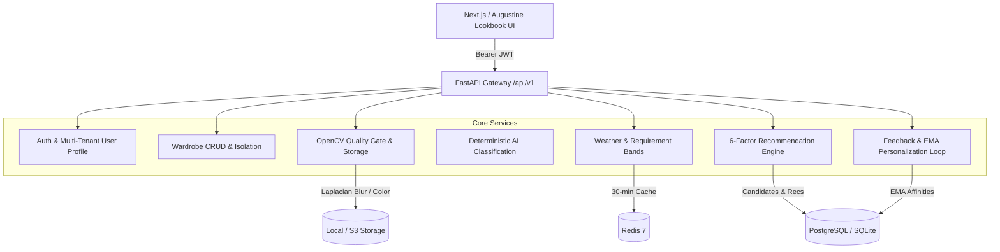

# ARMOIRE &mdash; Smart Wardrobe & AI Recommendation System

> **Strategic Foundation**: *"CHECK ALL EXISTING IDEAS OF THIS SOLUTION AND THEN MAKE MINE BETTER THAN THEM IN EVERY ASPECT."*


-success.svg)


---

## Overview

**Armoire (Smart Wardrobe)** is a production-grade personal styling platform that recommends complete, weather-appropriate outfits strictly from **clothes the user already owns**. 

Unlike incumbent digital closet apps (Whering, Acloset, Alta) that rely on opaque black-box recommendations or act as disguised retail shopping funnels, Armoire provides:
1. **100% Transparent, Explainable Recommendations**: Every outfit reveals its exact mathematical score across 6 dimensions.
2. **Honest, Deterministic Image Quality Gate**: OpenCV Laplacian blur variance and exposure checks. Enhancements are transparent, opt-in, and never generatively hallucinate unseen clothing details.
3. **Meteorological Requirement Bands**: Real-time OpenWeatherMap conditions mapped into 7 temperature bands driving layer guidance and extreme weather exclusions.
4. **Closed-Loop Personalization**: Exponential Moving Average ($\alpha = 0.3$) dynamically learns user color and category affinities from likes and wear events.
5. **Novelty & Diversity Protection**: Jaccard index with a 10-day exponential half-life decay prevents repetitive outfit suggestions.

---

## Architecture



---

## Core Specification Documents

The repository contains 5 comprehensive engineering specifications:

| Document | Purpose |
|---|---|
| [**`Master.md`**](./Master.md) | **Single Source of Truth** &mdash; Problem statement, competitive analysis, end-to-end data flow, security, testing, and metrics. |
| [**`Skills.md`**](./Skills.md) | **Technology Stack Rationale** &mdash; In-depth architectural trade-offs, deterministic vs. AI/ML boundary, and categorized skill levels. |
| [**`Design.md`**](./Design.md) | **UI/UX Design Specification** &mdash; 15 complete screen workflows, Augustine luxury editorial design system, color tokens, and accessibility standards. |
| [**`Backend.md`**](./Backend.md) | **Backend Architecture & Engineering** &mdash; 8 exhaustive pipelines, scoring formulas, DB schema, error handling, and Antigravity development instructions. |
| [**`Upgradation.md`**](./Upgradation.md) | **Product Evolution Plan** &mdash; 4-level roadmap from MVP &rarr; Advanced MVP &rarr; Production &rarr; AI Wardrobe Platform. |

---

## Recommendation Engine Formula

Every candidate outfit is ranked using a weighted 6-factor formula:

$$\mathbf{\text{Final Score}} = 0.25\,S_{\text{weather}} + 0.25\,S_{\text{occasion}} + 0.15\,S_{\text{color}} + 0.15\,S_{\text{style}} + 0.15\,S_{\text{personalization}} + 0.05\,S_{\text{diversity}}$$

- **WeatherScore ($S_w$)**: Curved warmth penalty ($1.0 - \Delta^{0.7}$) with extreme temperature exclusions.
- **OccasionScore ($S_o$)**: Formality matching across 13 occasion bands with asymmetric overdressing vs. underdressing penalties.
- **ColorScore ($S_c$)**: Rule-based HSL circular distance color theory (neutrals, monochrome, analogous, complementary, clash detection).
- **StyleScore ($S_s$)**: Garment embedding cosine similarity with pattern coherence fallback.
- **PersonalizationScore ($S_p$)**: EMA color and category affinity matching with logarithmic wear-count bonus.
- **DiversityScore ($S_d$)**: Jaccard similarity against recently worn outfits with a 10-day exponential half-life decay.

---

## Repository Structure

```text
.
├── .github/
│   └── workflows/
│       └── backend-ci.yml        # CI/CD pipeline (migrations, tests, Docker build)
├── backend/
│   ├── app/
│   │   ├── ai/                   # Classification, OpenCV quality gate, color clustering
│   │   ├── api/v1/               # FastAPI route controllers
│   │   ├── core/                 # Config (pydantic-settings), security (JWT/bcrypt), logging
│   │   ├── image_processing/     # Pluggable storage (Local / S3)
│   │   ├── models/               # SQLAlchemy 2.0 ORM models (10 tables)
│   │   ├── recommendations/      # 6 scoring modules + recommendation engine
│   │   ├── repositories/         # Row-level multi-tenant DB repositories
│   │   ├── schemas/              # Pydantic v2 validation contracts
│   │   ├── services/             # Core business logic services
│   │   ├── static/               # Augustine luxury frontend lookbook UI (SPA)
│   │   ├── weather/              # OpenWeatherMap client & requirement band mapping
│   │   ├── workers/              # Celery background tasks
│   │   └── main.py               # FastAPI entrypoint
│   ├── alembic/                  # Database migration versions
│   ├── scripts/                  # Demo capsule wardrobe seeder
│   ├── tests/
│   │   ├── unit/                 # Quality gate, security, weather, engine tests
│   │   └── integration/          # Upload pipeline, recommendations & feedback loop
│   ├── Dockerfile
│   ├── docker-compose.yml
│   └── requirements.txt
├── .gitignore
├── Backend.md
├── Design.md
├── Master.md
├── Skills.md
├── Upgradation.md
└── README.md
```

---

## Quickstart

### 1. Local Setup
```bash
# Clone the repository
git clone https://github.com/amritadube120208/armoire.git
cd armoire/backend

# Install dependencies
pip install -r requirements.txt

# Run migrations
alembic upgrade head

# Seed the 15-piece demo capsule wardrobe
python -m scripts.seed_demo_wardrobe

# Start the server
python -m uvicorn app.main:app --host 0.0.0.0 --port 8000 --reload
```

### 2. Access the Application
- **Augustine Lookbook Frontend UI**: [http://localhost:8000](http://localhost:8000)
- **Interactive Swagger API Docs**: [http://localhost:8000/api/v1/docs](http://localhost:8000/api/v1/docs)
- **ReDoc API Manual**: [http://localhost:8000/api/v1/redoc](http://localhost:8000/api/v1/redoc)
- **Pre-Seeded Demo Credentials**:
  - Email: `demo@smartwardrobe.com`
  - Password: `Password123!`

### 3. Run the Automated Test Suite
```bash
python -m pytest -v
# 36 passed in unit and integration test suites
```

### 4. Run with Docker Compose
```bash
cd backend
docker compose up --build
```
Orchestrates FastAPI, PostgreSQL 16 with pgvector, Redis 7, and a Celery worker.

---

## License

MIT License. Designed and architected as a production-grade AI Wardrobe Platform.
